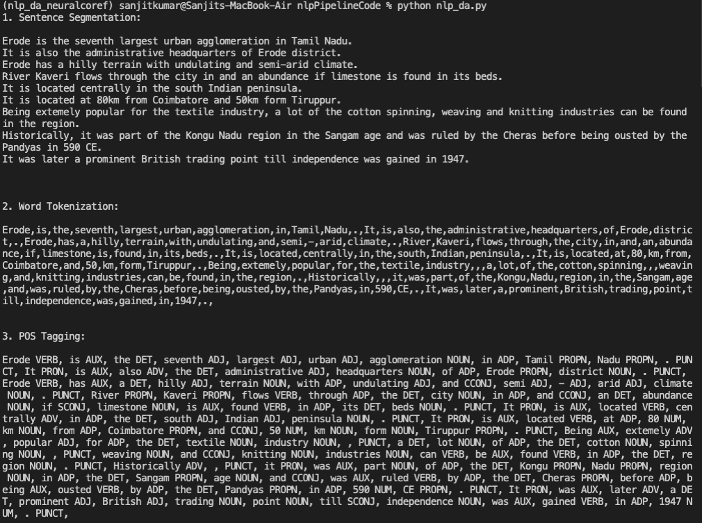
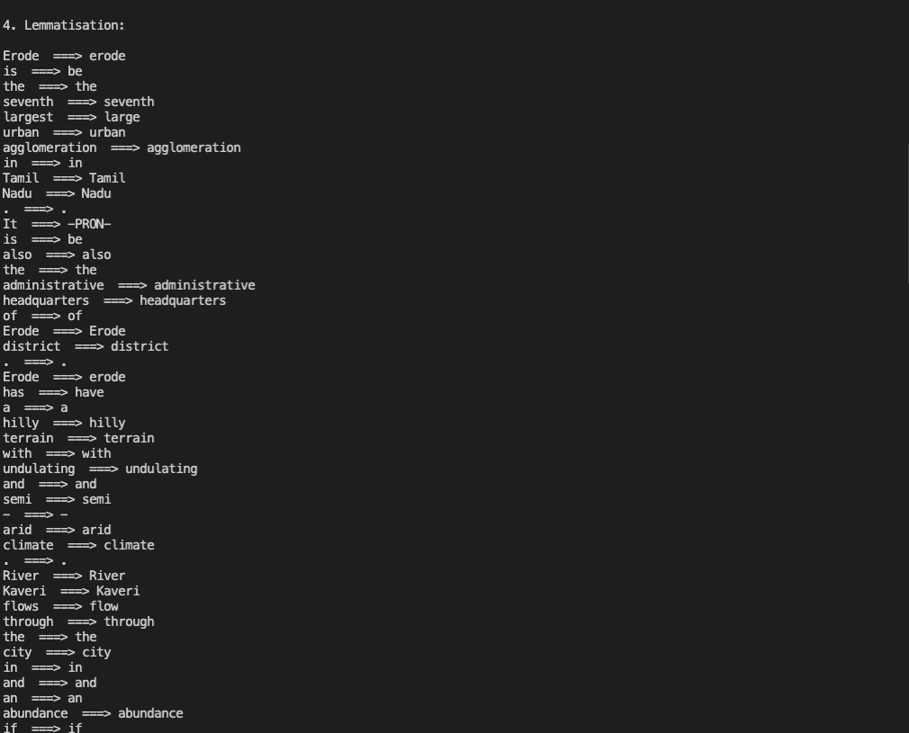
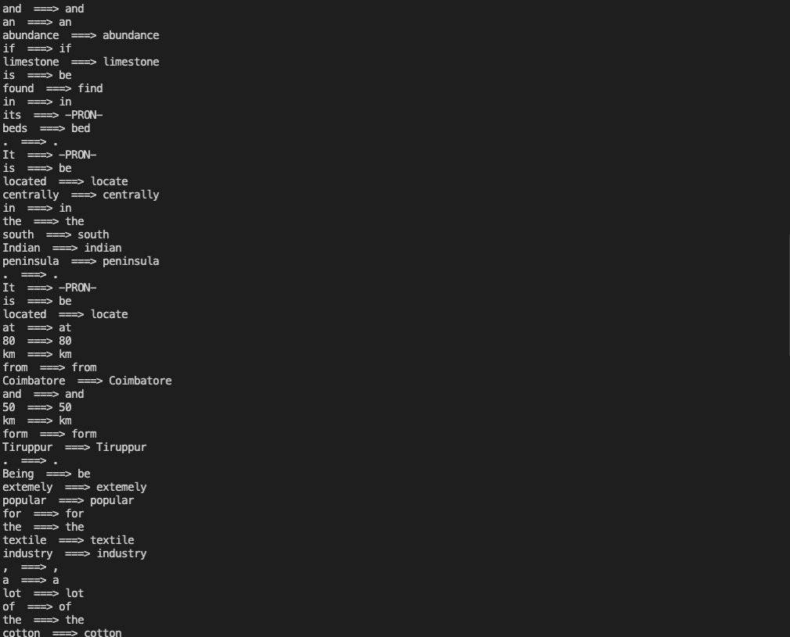
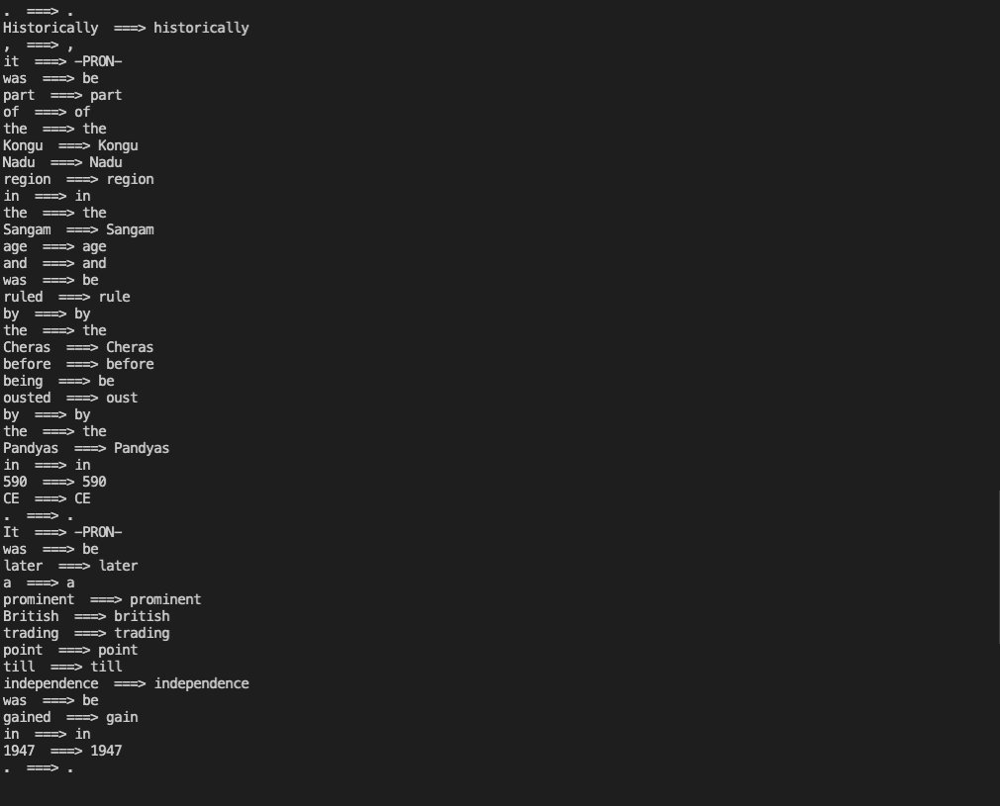
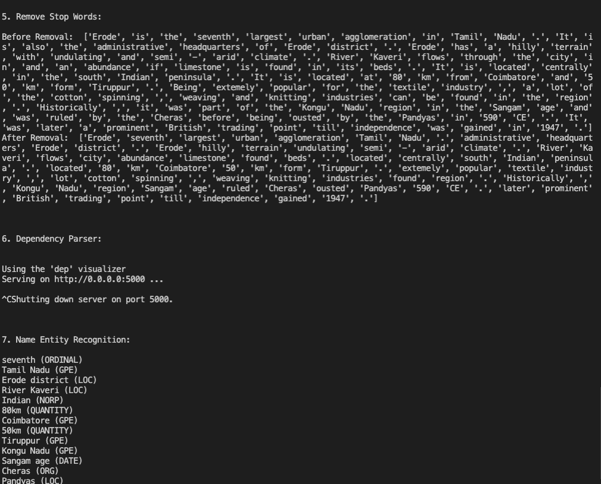
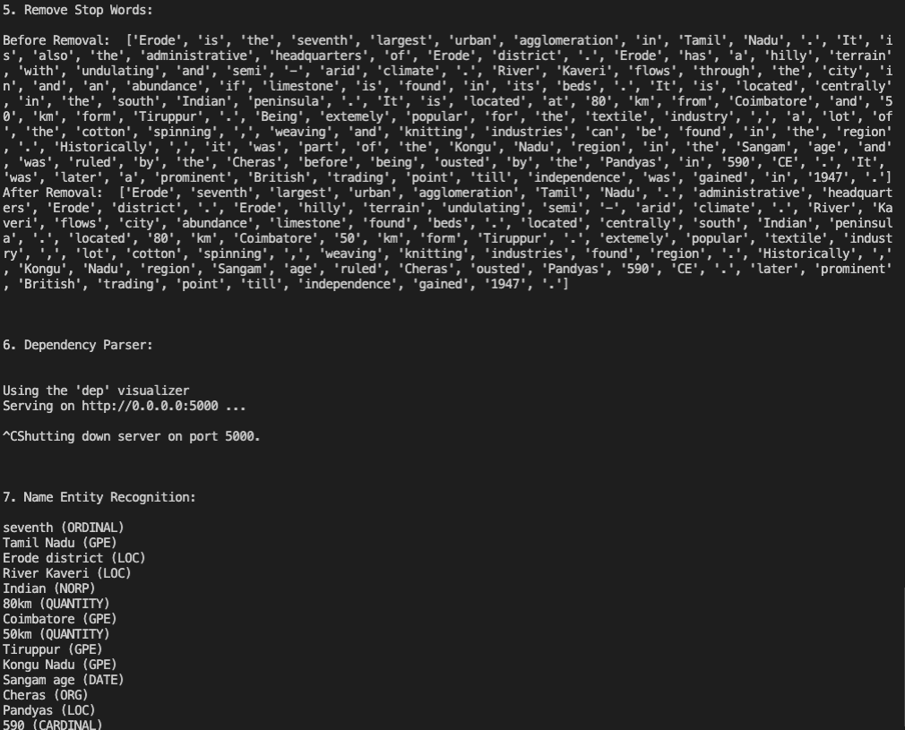

# Implementation of an Sample NLP Pipeline

### Dependencies:
1. spacy
2. nltk
3. neuralcoref

### Pipeline
1. Sentence Segmentation
2. Word Tokenisation
3. POS Tagging
4. Lemmatization
5. Stop Words Removal
6. Dependency Parsing
7. Name Entity Recognition
8. Co-reference Parsing (Not)

Find Complete Output and Explanation in this [PDF](./doc.pdf).

### Output

